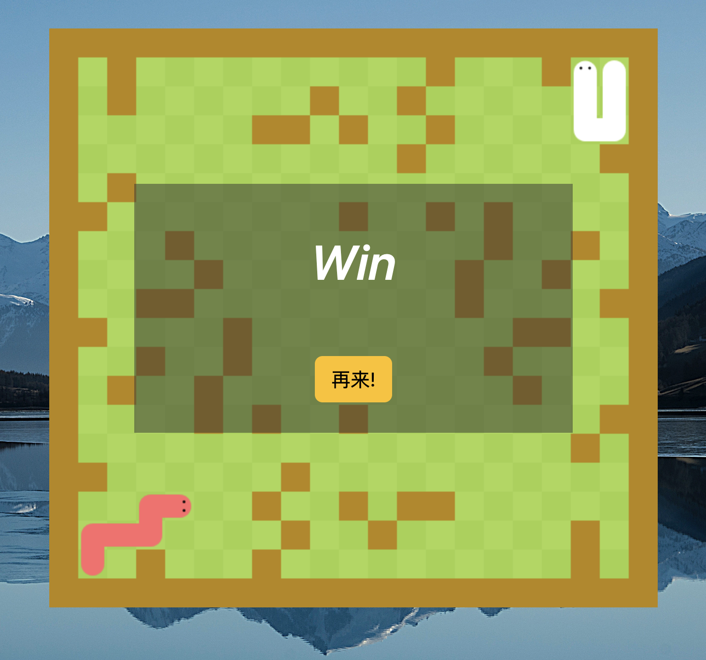
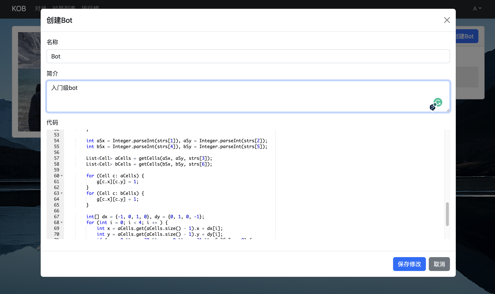

# KOB

## 用户注册登录界面

## 匹配对战界面
玩家点击开始匹配，系统会给玩家分配天梯积分最接近的玩家。

## 游戏界面
操作方式：玩家亲自出马，WASD操控蛇移动的方向 或者 通过代码操控蛇的移动。

## 对局记录界面
玩家可以查看所有的游戏对局的胜负关系和对局回放

## 天梯积分排行榜
玩家可以查看服务器中所有玩家的天梯积分

## Bot管理编辑界面
玩家可以管理Bot，可以修改Bot代码

## 技术栈
前端vue、js、bootstrap， 后端 springboot、mysql、mybatis、springsecurity
